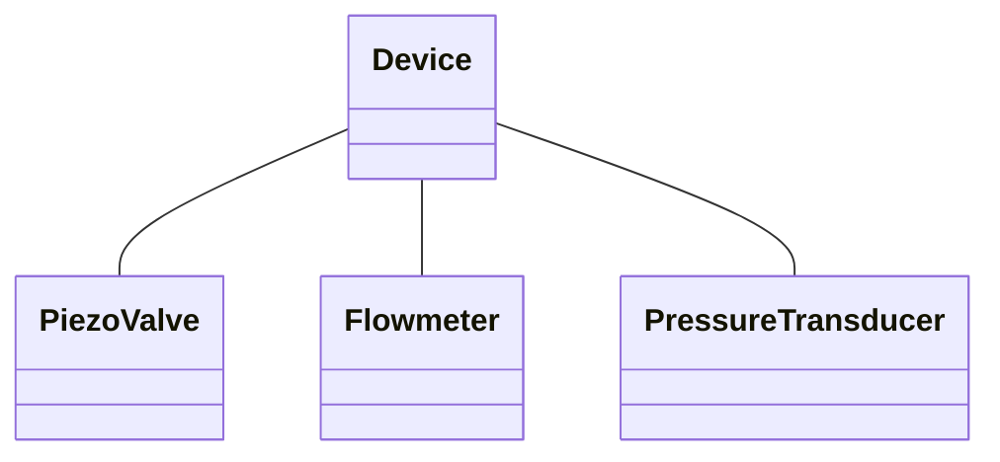
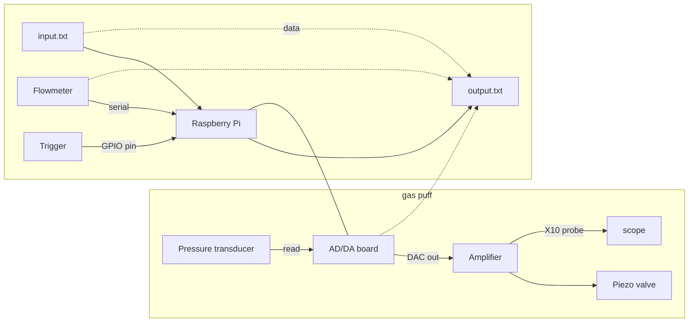

# bapsf_gaspuff

```mermaid
classDiagram
    Device -- PiezoValve
    Device -- Flowmeter
    Device -- PressureTransducer
```

```mermaid
flowchart LR
    subgraph gas[gas puff]
    direction LR
    ADC[AD/DA board] -->|DAC out| amp[Amplifier]
    amp --> piezo[Piezo valve]
    amp --> |X10 probe|scope
    psi[Pressure transducer] -->|read| ADC
    end

    subgraph central[" "]
    in["input.txt"]-->Pi[Raspberry Pi]
    Pi-->out["output.txt"]
    flow[Flowmeter] -->|serial| Pi
    Trigger -->|GPIO pin| Pi
    flow .-> out
    end

    in .->|data| out["output.txt"]
    ADC .-> out
    Pi --- ADC
```
