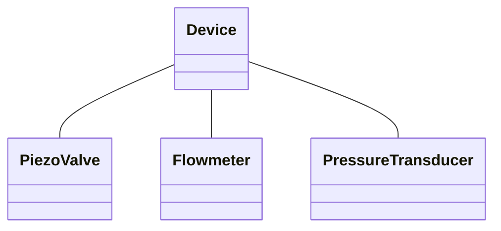

# bapsf_gaspuff



```mermaid
flowchart LR
    subgraph gas[gas puff]
    direction LR
    ADC[AD/DA board] -->|DAC out| amp[Amplifier]
    amp --> piezo[Piezo valve]
    amp --> |optional|scope
    psi[Pressure transducer] -->|ADC in| ADC
    end

    Pi === ADC

    subgraph central[" "]
    in["input.txt"]-->Pi[Raspberry Pi]
    Pi-->out["output.csv"]
    Pi.->|time data| out["output.csv"]
    flow[Flowmeter] -->|serial| Pi
    Trigger -->|GPIO pin| Pi
    TimeServer --> Pi
    flow .->|data| out
    end

    in .->|data| out["output.txt"]
    psi .->|data| out
```
