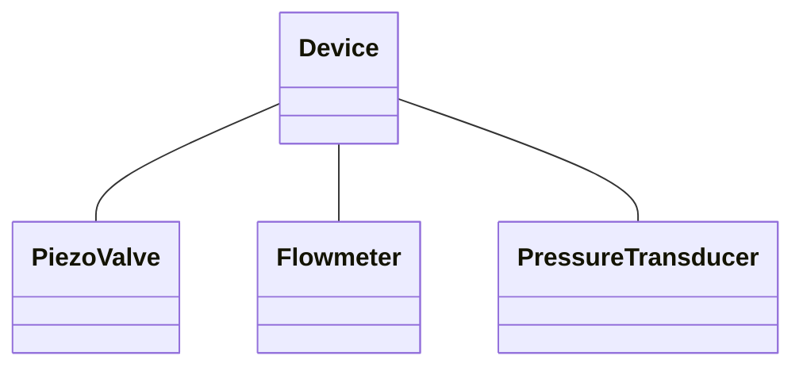

# bapsf_gaspuff

flow meter api documentation: https://sensirion.github.io/python-shdlc-sfc5xxx/index.html

```mermaid
classDiagram
    Device -- PiezoValve
    Device -- Flowmeter
    Device -- PressureTransducer
```

```mermaid
flowchart LR
    subgraph gas[gas puff]
    direction LR
    ADC[AD/DA board] -->|DAC out| amp[Amplifier]
    amp --> piezo[Piezo valve]
    amp --> |optional|scope
    psi[Pressure transducer] -->|ADC in| ADC
    end

    Pi === ADC

    subgraph central[" "]
    in["input.txt"]-->Pi[Raspberry Pi]
    Pi-->out["output.csv"]
    Pi.->|time data| out["output.csv"]
    flow[Flowmeter] -->|serial| Pi
    Trigger -->|GPIO pin| Pi
    LabTimeServer --> Pi
    flow .->|data| out
    end

    in .->|data| out["output.txt"]
    psi .->|data| out
```

## Flow-meter acquisition

Two files under [`src/`](src/) implement the flow-meter pipeline:

| File | Role |
| --- | --- |
| [`src/FlowMeterCommunication.py`](src/FlowMeterCommunication.py) | `FlowMeter` class — thin wrapper over the Sensirion SHDLC SDK for SFC5xxx mass-flow controllers. |
| [`src/flowmeter_main.py`](src/flowmeter_main.py) | Pi-side entry point. Waits for a GPIO trigger and writes one HDF5 row per shot. |

### How it runs

```
GPIO trigger ──▶ main loop ──▶ q_trigger ──▶ East worker ──▶ q_data ──┐
                                       └──▶ West worker ──▶ q_data ──┴──▶ HDF5 file
```

The main process owns the GPIO trigger and the HDF5 file. Two child processes (one per meter) own the serial connections and read on demand. On every rising edge of `TRIGGER_PIN` the main process broadcasts `'TRIG'`, drains two `MeterShot` messages from the data queue, and appends them to the daily HDF5 file. On worker error a `MeterShot` carrying `np.nan` is sent so the pair is always complete.

### Configuration

All settings live at the top of [`src/flowmeter_main.py`](src/flowmeter_main.py):

| Constant | Meaning |
| --- | --- |
| `HDF5_PATH` | Output directory for `flow_data_<YYYY-MM-DD>.hdf5` |
| `GPIO_LIB_PATH` | Path to `gpio_detect.so` (pigpio wrapper) |
| `TRIGGER_PIN` | BCM pin number for the rising-edge trigger |
| `TRIGGER_TIMEOUT_MS` | How long `wait_for_trigger` blocks per call |
| `PORT_EAST` / `PORT_WEST` | Serial-by-id paths to the two flow meters |
| `ADDR_EAST` / `ADDR_WEST` | SHDLC slave addresses (East = 2, West = 0) |
| `READ_WAIT_S` | Settle delay between TRIG and buffer read |
| `FIRST_/SECOND_METER_TIMEOUT_S` | `queue.get` timeouts for the two shots |
| `MAX_FLOW_METER_RETRIES` | Failure count before logging a give-up message |

### HDF5 file layout

`init_hdf5_file` creates one file per day with two groups:

```
flow_data_<date>.hdf5
├── attrs:
│     created       (struct_time tuple)
│     description   ("Flow meter data from Sensirion flow meters")
│     data_length   (samples per shot, set on first successful read)
├── FlowMeter_East/
│     attrs: description, port, address, unit
│     flow_data   (N_shots, data_length)  float32
│     timestamp   (N_shots,)              float64
└── FlowMeter_West/
      attrs: description, port, address, unit
      flow_data   (N_shots, data_length)  float32
      timestamp   (N_shots,)              float64
```

The file is opened/closed per shot for crash-durability and uses HDF5 SWMR mode so external readers can follow along.

### Running

```bash
# On the Pi:
cd bapsf_gaspuff/src
python flowmeter_main.py
# Ctrl-C to stop. Workers receive 'QUIT', join cleanly, and GPIO is released.
```

Daily files roll over automatically — when the day-of-year of `attrs['created']` no longer matches "today", a new `flow_data_<date>.hdf5` is initialized and used for subsequent shots.

### `FlowMeter` API (read-side)

| Method | What it returns |
| --- | --- |
| `get_reading(duration)` | Polls the device buffer until `duration * SAMPLE_RATE_HZ` samples are collected. |
| `get_single_buffer()` | One buffer chunk (`max_reads=1`) — useful for low-latency polling. |
| `get_reading_single_cycle(duration)` | One sample per call, host-paced. Slower but timing is controlled by the loop. |
| `get_pre_and_post_trigger_samples(pre, post)` | Splice the tail of the device buffer with `post` newly polled samples. |

`SAMPLE_RATE_HZ = 1000` is the SFC5xxx internal buffer rate.

