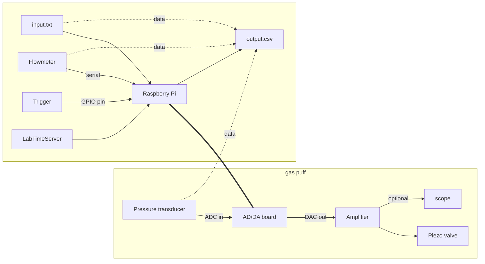

# bapsf_gaspuff

Monitoring of the gas-puff and pressure system of LAPD at the **Basic Plasma Science Facility (BAPSF)**. The repository covers two largely independent subsystems:

1. **Pfeiffer Vacuum gauge logging** — continuous pressure acquisition and real-time monitoring (see below).
2. **Gas-puff acquisition** — a Raspberry Pi pipeline tying together a Sensirion flow meter, a piezo valve driven through an AD/DA board, and a pressure transducer.

---

## Pfeiffer Vacuum Gauge

Everything for the Pfeiffer subsystem lives in [pfeiffer/](pfeiffer/). It talks to a **Pfeiffer Vacuum MaxiGauge TPG 366** controller over Ethernet, continuously logs every connected sensor's pressure to daily HDF5 files, and provides a live plotting GUI.

### Hardware & connection

- **Controller:** Pfeiffer MaxiGauge TPG 366 (up to 6 pressure sensors).
- **Transport:** TCP socket over Ethernet — default controller IP `192.168.7.44`, port `8000`.
- **Protocol:** Pfeiffer serial/ASCII mnemonic protocol (`PRX`, `TID`, `GAS`, etc.) with ACK/NAK handshaking, tunneled over the socket. Line termination is `CR+LF`.
- **Units:** Pressure logged in **Torr**.

### Files

| File | Purpose |
|------|---------|
| [pfeiffer/PfeifferVacuumCommunication.py](pfeiffer/PfeifferVacuumCommunication.py) | Low-level driver. Defines the `MaxiGauge` class (socket connect/disconnect, mnemonic send/enquire, ACK/NAK handling) and the `MaxiGaugeError` / `MaxiGaugeNAK` exceptions. |
| [pfeiffer/Pfeiffer_control.py](pfeiffer/Pfeiffer_control.py) | Acquisition loop. Continuously polls all sensors and appends readings to a daily HDF5 file. |
| [pfeiffer/Pfeiffer_GUI.py](pfeiffer/Pfeiffer_GUI.py) | PyQt5 real-time plotting GUI that reads the latest HDF5 file. |

### `MaxiGauge` driver (key methods)

- `connect()` / `disconnect()` — open/close the TCP socket (2 s timeout, up to 300 retries).
- `get_all_pressure_reading()` — returns `(status_list, pressure_list)` for all sensors via the `PRX` mnemonic, with retry on garbled responses.
- `get_device_id()` — sensor model IDs (`TID`).
- `get_gas_type()` — gas calibration setting per sensor (`GAS`), mapped through the `GAS_TYPE` table (Nitrogen, Argon, Hydrogen, Helium, Neon, Krypton, Xenon, CAL).
- `pressure(sensor)` — single-sensor reading (`PR<n>`), with status decoded via `PRESSURE_READING_STATUS` (e.g. *Underrange*, *Overrange*, *Sensor error/off*, *No sensor*).

### Acquisition: `Pfeiffer_control.py`

Run this to start logging:

```bash
cd pfeiffer
python Pfeiffer_control.py
```

What it does:

- Writes to `C:\data\gauge\pressure_data_<YYYY-MM-DD>.hdf5`, rolling over to a new file automatically at the day boundary.
- HDF5 layout: a `PfeifferVacuum` group containing one resizable dataset per sensor (`"1"`, `"2"`, …) plus a `timestamp` dataset (seconds since epoch). Each sensor dataset carries `Model`, `Gas`, `Unit`, and `Modified time` attributes; when a gauge or gas setting changes, the new value is appended to the relevant attribute list rather than overwritten.
- Uses **HDF5 SWMR (Single-Writer/Multiple-Reader)** mode so the GUI can read while the writer is running.
- **Resilience:** logs connection STARTED / LOST / RECOVERED events to `C:\data\gauge\connection_log.txt`, transparently reconnects on `MaxiGaugeError`/`TimeoutError`, and auto-recovers from stale SWMR locks by invoking `h5clear` (tries `h5clear` on `PATH`, then a vendored fallback path).

> **Configuration:** the controller IP, HDF5 output directory, and `h5clear` fallback path are set near the top of [pfeiffer/Pfeiffer_control.py](pfeiffer/Pfeiffer_control.py). Adjust them for your machine.

### Live monitoring: `Pfeiffer_GUI.py`

```bash
cd pfeiffer
python Pfeiffer_GUI.py
```

A PyQt5 window that opens the most recent HDF5 file in `C:\data\gauge` (SWMR read) and refreshes every 0.5 s in a background thread. It shows two stacked panels:

- **Top:** the last 30 seconds of pressure.
- **Bottom:** the full day binned into 5-minute averages.

The sensor to plot (`sensor_number`) and the rolling window length (`n_points`) are configurable at the top of the file.

### Dependencies (Pfeiffer)

`h5py`, `numpy`, `portalocker`, `PyQt5`, `matplotlib`, and the HDF5 `h5clear` command-line tool (bundled with the HDF Group HDF5 distribution).

---

## Gas-Puff Acquisition (overview)

The gas-puff side runs on a Raspberry Pi and coordinates the valve, flow meter, and pressure transducer. The data flow:


```mermaid
flowchart LR
    subgraph gas[gas puff]
    direction LR
    ADC[AD/DA board] -->|DAC out| amp[Amplifier]
    amp --> piezo[Piezo valve]
    amp --> |optional|scope
    psi[Pressure transducer] -->|ADC in| ADC
    end

    Pi === ADC

    subgraph central[" "]
    in["input.txt"]-->Pi[Raspberry Pi]
    Pi-->out["output.csv"]
    flow[Flowmeter] -->|serial| Pi
    Trigger -->|GPIO pin| Pi
    LabTimeServer --> Pi
    flow .->|data| out
    end

    in .->|data| out
    psi .->|data| out
```

- **Flow meter:** Sensirion SFC5xxx, accessed over the SHDLC serial protocol. Driver docs: <https://sensirion.github.io/python-shdlc-sfc5xxx/index.html>
- **Trigger:** hardware shot trigger read on a Raspberry Pi GPIO pin (via a small C library, `gpio_detect.so`).
- **Output:** per-shot flow data saved to HDF5.

Arduino firmware for the trigger/status display lives in [arduino_src/](arduino_src/), and hardware datasheets (AD/DA board, amplifiers, Arduino) are in [doc/](doc/).

---

## Repository layout (`src/`)

The [src/](src/) directory holds the gas-puff Raspberry Pi code. It is a separate pipeline from the Pfeiffer logger above.

| File | Role |
|------|------|
| [src/flowmeter_main.py](src/flowmeter_main.py) | Main acquisition entry point — GPIO trigger handling, multiprocessing-based flow capture, and per-shot HDF5 saving. |
| [src/FlowMeterCommunication.py](src/FlowMeterCommunication.py) | `FlowMeter` wrapper around the Sensirion `sensirion-shdlc-sfc5xxx` driver. |
| [src/wavegen_control.py](src/wavegen_control.py) | Driver for the waveform generator / AD/DA board used to drive the piezo valve. |
| [src/kernel.py](src/kernel.py) | High-level `GasPuffValve` interface coupling the valve, trigger, and waveform output. |
| [src/input.py](src/input.py) | Waveform definition (`generate_pulse_waveform`) and a small Tkinter control panel. |
| [src/main.py](src/main.py) | Standalone example that programs and bursts a pulse waveform. |

> Note: some wavegen-coupled paths are partially archived/commented; `flowmeter_main.py` is the current acquisition driver.

---

## License

See [LICENSE](LICENSE).
